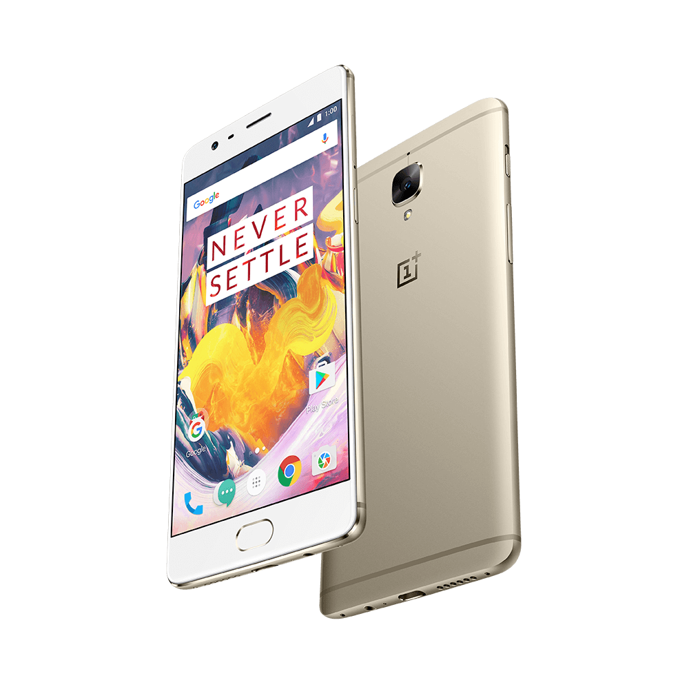

<em>OnePlus 3T Soft Gold</em>

## Three days with the OnePlus 3T

Here we are… My first blog post on this site. I’ve been contemplating about writing on Medium on and off for a while now. I figured it would be the perfect time to publish my first article now that I have used the OnePlus 3T for the last 3 days. I hope this article sheds some light on using it on a daily basis for those interested. With that said, let’s jump right in!

## Speed

The OnePlus 3 is already a more than capable phone with its Snapdragon 820, but OnePlus decided to step it up one more time with the 3T. This phone packs a Snapdragon 821 (basically the 820 with a higher clockspeed instead of the underclocked 821 in the Google Pixel), which slightly improves on the 820. This, in addition to the 1080p screen and the ridiculous 6 gigabytes of RAM, results in a phone that is buttery smooth under pretty much all conditions.

Whether it manages to retain that speed needs to be seen, but those who like to tinker with their phones will be happy to hear that the custom rom scene for the OnePlus 3T is steadily growing, so you can always regain that speed by flashing a new ROM.

## Soft Gold Color

> “I didn’t come here just for the specifications!”

I fully understand that! Lets talk about the exterior of the phone.

I was among one of the first to be able to experience the Soft Gold color in the Netherlands. I have to say I was a little nervous when ordering, because of the white front. That doubt quickly faded away when opening the box. The white front gives off a vibe of subtlety while complementing the soft gold back of the phone in a nice way.

Speaking of which: I think it’s gorgeous! It’s definitely not the flashy and ‘look at me, I’m so fancy’ kind of gold, but more like a matte gold. The matte gold is accentuated nicely by the color of the antenna bands on the top and bottom of the chassis. It’s definitely a special color combination.

Not only the the phone itself impresses in this package. The thing that stood out to me most during the unboxing was the presentation of OnePlus’ red and white theme. It’s even in the power brick and the usb plug of the charging cable! That makes the overall experience just that little more special.

## Battery Life

> “That’s nice and all, but I want my phone to last throughout the day”

No problem… This phone easily lasts you through a full day. I only charge my phone once every 1.5 days after an average of 5 hours of screen on time, but keep in mind that I’m not the kind of person that plays loads of games throughout the day.

If you are a power user you shouldn’t be worried either, because the Dash Charge technology is amazing. On one occasion I plugged the phone in before getting ready to go to bed and 10–15 minutes later it had been charged from 11% all the way up to around 35%! It charges so fast, that I changed my charging habit from nightly charges to topups when it’s needed.

## Conclusion

I can’t comment on the camera’s yet, battery life may deteriorate over time and we’ll see about the performance hit in half a year, but I can confidently say that I do not see the justification for spending near double the amount on other flagships yet. You may argue that the screen is not up to par, but I personally prefer a good 1080p screen over a 2k screen for the respective performance and battery life increase.

All in all it’s a lot of phone for your hard earned money . If you are looking for a new phone, I’d definitely consider the OnePlus 3T. OnePlus could well be the Nexus replacement at the value for dollar you are getting (were it not for a few hickups in the [open sourcing of their kernel sources](https://www.xda-developers.com/xda-developers-urges-oneplus-to-comply-with-gplv2-and-release-kernel-sources/)).

And please, choose the Soft Gold variant when purchasing this phone. You will not be disappointed.
