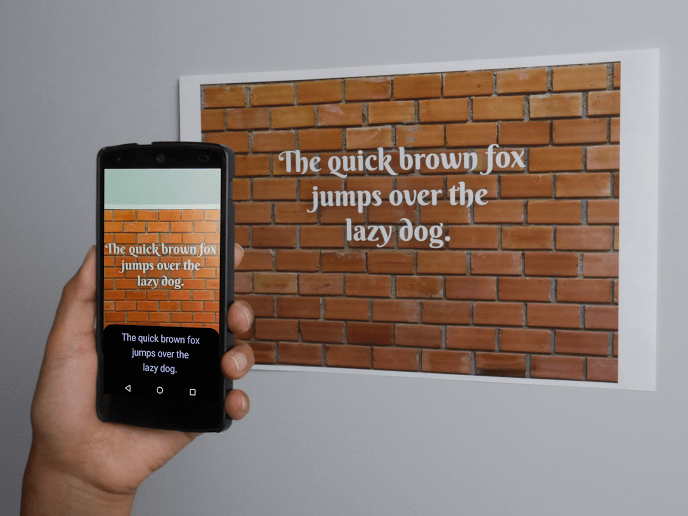

For a while now everybody and their mom has gone crazy over machine learning. It even got to the point of people asking developers if they would be able to implement these machine learning algorithms into their standard portfolio website, just because it‘s the latest trend.  
That said, there are definitely situations in which a good Machine Learning algorithm can open the doors to a whole new set of possibilities.

But how easy is it to open those doors in this day and age?  
Can you make use of algorithms without having to write a single line of algorithm code?  
I’d say yes, as long as you stick to the more tested waters.

## Current state

We are slowly arriving at the point of getting drop-in solutions for generic problems/situations that DO benefit from machine learning.

  <a href="https://developers.google.com/vision/">
    <em>Source</em>
  </a>

Take for example [OCR (Optical Character Recognition)](http://en.m.wikipedia.org/wiki/Optical_character_recognition). This can be handy for a number of reasons, ranging from live translation to making analog to digital text conversion simple. The best part is that you can easily drop it into your application with, for example, Google’s [Mobile Vision API](https://developers.google.com/vision/). Not a single line of algorithm code has to be written.  
**So that’s exactly what I did.**

Using the Text Recognition API I’ve built an app that pastes text on the clipboard based on the amount of times it recognises that character/text element in the viewport. It was quite simple to make and really shows the strength that the Google pre-made algorithms have.

Google is not the only one trying to get their foot in the door when it comes to providing drop-in machine learning algorithms though. Apple has also laid out a foundation with their [Core ML](https://developer.apple.com/machine-learning/) platform. This allows you to integrate vision and natural language processing algorithms into your IOS apps too.

Not everything is positive though. The biggest drawback of a pre-made algorithm is that it may not be applicable to your specific situation. That means that it’s still far away from being able to satisfy everyone’s need.  
For that, there’s something new in development.

### The hot new item

<iframe width="560" height="315" src="https://www.youtube-nocookie.com/embed/GbLQE2C181U" frameborder="0" allow="accelerometer; autoplay; encrypted-media; gyroscope; picture-in-picture" allowfullscreen />

One of the latest advancements in the field of machine learning is Google’s AutoML which Sundar Pichai, CEO of Google, teased at Google IO last year.  
Today, a [blog post](https://blog.google/topics/google-cloud/cloud-automl-making-ai-accessible-every-business/) has been published by Google stating that their AutoML platform can be used in the Alpha stage.  
For now it’s only possible to self-train a model for image recognition, but they are planning on bringing more model possibilities in the coming months.  
With this approach you can finetune the algorithm to your specific needs and wants instead of having to use a pre-made one.

## Glamorous future

The above mentioned AutoML project has been developed together with the Google Brain team who also made a big leap November last year with [developing a ‘child AI’](https://research.googleblog.com/2017/11/automl-for-large-scale-image.html?m=1) that outperformed all previous human developed algorithms. This means that there is quite a possibility of algorithms developing their own algorithms in the future.

This all shows that we’re definitely not at the point of extreme maturity with globally available and usable Machine Learning algorithms just yet, but are getting closer day by day.  
Projects like Google’s AutoML and the work of the Brain team mean we have a bright future in front of us for widely available machine learning algorithms.  
It’s definitely something to get excited about!
