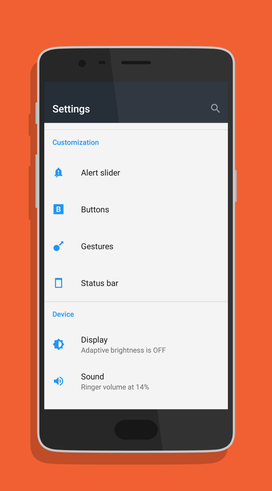

OnePlus’ skin on top of Android looks like an exact copy of stock Android.  
But don’t let the standard looks fool you. Once you open the Settings app and tinker around for a bit, you can see there’s more than meets the eye.  
In this article, we’ll dive deeper into the customization this phone provides right out of the box.

## Buttons section

OnePlus has always been a company that likes to give you the choice between capacitive and onscreen navigation buttons. Luckily it’s no different on the OnePlus 3T (and 3 for that matter). There’s also an option to toggle the backlight of the capacitive keys and swap the back and recents buttons if you want. Good stuff!

Even more interesting is the option to assign an action to each of the three capacitive buttons (back, home and recents) for a long press AND a double tap. With that, you get loads of options to choose from, including voice search, a camera shortcut and opening/closing split screen. The only option I miss is the ability to assign a 3rd party application to a long press or double tap. Let’s hope OnePlus considers to add this in a future revision of their software.

## Gestures section

There are currently two categories in the ‘Gestures’ tab on the OnePlus 3(T): Screen off gestures and System gestures.

I find the screen off gestures to be the nicest of them, especially the flashlight toggle, which you can activate by drawing a V on the screen when it’s off. The detection of these gestures are on point as well. The phone recognises shapes nicely and gives you feedback by vibrating when activating or deactivating a feature.

The system gestures section contains an option to make a screenshot with a three finger swipe and also has the ability to mute your phone by flipping it when you have an incoming call. All nice options to have and know about.

## Display section

The ‘Display’ tab contains various visual customizations. There is a night mode option, which filters out the blue light of the display for late night reading, as well as a theme option which allows you to switch between the default Android theme, a light theme and a dark theme. The light and dark themes also come with the ability to set the accent color which even extends to the quick settings tiles!

You can also enable the ambient display option to check your notifications by waving your hand over the proximity sensor of the phone. This feature is very battery friendly, because of the AMOLED panel on the device in combination with the black and white notifications displayed when in ambient mode. I have an upcoming article that goes into the difference between AMOLED and LCD if you are interested in why this is the case.

OnePlus has also integrated a screen calibration option. You can choose between the default (your average oversaturated AMOLED colors), sRGB or your own configuration. That last option doesn’t give you much to play with unfortunately, as you only have the option to define the warmth of the display.

## Security & fingerprint section

An interesting bonus in this section is the ability to lock certain apps with your fingerprint via the App locker option. Once you have provided your security credentials, you can select which apps you want to lock with your fingerprint. After setting it up, you have to login with your fingerprint everytime you open one of the selected apps. There will be a cooldown after logging into an app, so you don’t have to login again within a short period of time.

## Advanced section

> Are we there yet?

Nope, the advanced section has some interesting features to check out as well. You can select if you want pocket mode on or off, preventing accidental touches or fingerprint operations when the phone is in your pocket. I suggest leaving this on, I never had any problems with this setting.

There’s also the ability to select on what level you want to clear the apps when pressing the clear all button in the recents screen. I suggest leaving this in normal mode, Android’s Doze system should kick in after a certain amount of inactivity of the phone, preventing unnecessary wakelocks from apps. But hey, you can atleast change it if you want to!

## That’s it!

We have succesfully completed our quest to discover all the awesome features OnePlus has baked into their version of Android. I hope I introduced a feature you didn’t know of yet and/or made an entertaining article!
