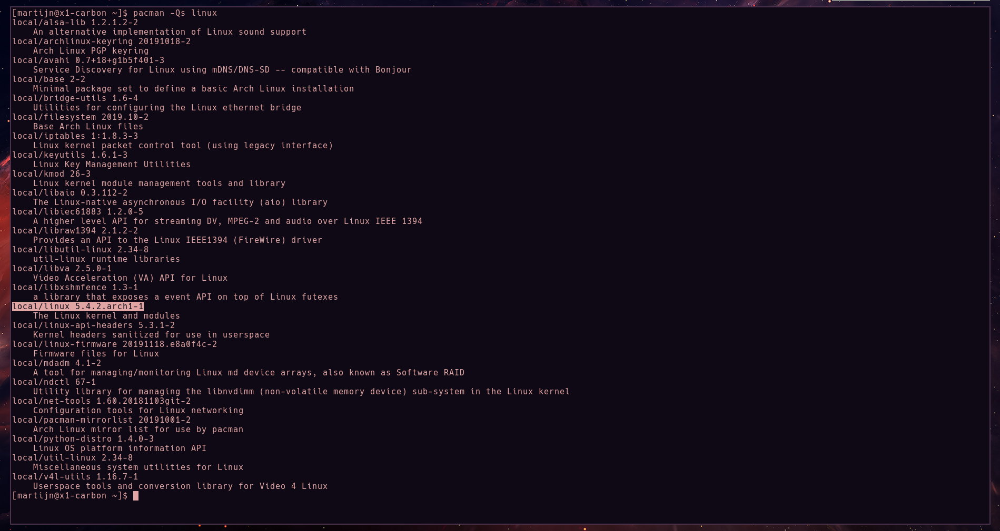

import InfoBox from "../../../src/components/infobox.js"



I've been running into some audio and suspend issues after updating to Linux 5.4.2 on my Arch Linux intallation. Fortunately I was able to fix them both with a single kernel parameter!

<InfoBox type="warning">
    This proved to work on my Lenovo Thinkpad X1 Carbon 7th gen. Your mileage might vary.
</InfoBox>

# The problems
## Audio
The first thing I noticed after the upgrade to 5.4.2 was the lack of audio when playing a YouTube video.

At first I thought a low volume level was the culprit, but that quickly turned out to be wrong. No level of volume increase could make the speakers fire (believe me, I've tried up to 180%).

## Freeze after suspend
This one was a particularly annoying problem. Every time I would open the lid of my laptop it would freeze with no way for me to get to a command line. I've tried waiting for a good 10 minutes in hopes of the laptop unfreezing. That turned out to have no effect though. The only way I could get my system operational again was by doing a hard shutdown, which is not ideal to say the least.

# Troubleshooting

After my experiment with raising the volume, the next logical step was trying my Bluetooth headset. Luckily, that device DID work.  

Cool, know we narrowed the problem down to the internal speakers. Since I've had to do [some manual configuration](https://wiki.archlinux.org/index.php/Lenovo_ThinkPad_X1_Carbon_(Gen_7)#Audio) when installing Arch Linux, my focus immediately shifted to that particular PulseAudio configuration file. Would some settings be erased by any chance? That can't be, I've made sure to exclude the file from being updated by Pacman?! After a quick visit with [nano](https://wiki.archlinux.org/index.php/Nano) I was reassured that all the settings remained intact.

Only after dragging my good old friend Google into this I managed to find [people having similar issues](https://bbs.archlinux.org/viewtopic.php?id=251157). Before I knew it, I had the solution at hand. This was further confirmed by [a bug report](https://bugs.archlinux.org/task/64720) in which is stated that a fix for this problem will be integrated in kernel version 5.5 (1).

Luckily for me this also fixed the freezing after suspend. A logical reason for this is that an error in detecting the correct audio firmware (`Direct firmware load for intel/sof/sof-cnl.ri failed with error -2`) was the culprit of a messed up system to the point of freezing completely. I found this error after running `journalctl -p 3 -xb`, which only displays error messages since last boot.

# The solution
The quick and easy solution to this problem was adding the following text to the kernel parameters:

```bash
snd_hda_intel.dmic_detect=0
```

I decided to do this via the `/etc/default/grub` file in order for my setting to stick after reboot. We edit `/etc/default/grub` because its best practice to override with `grub-mkconfig` instead of changing `/boot/grub/grub.cfg` directly.

Make sure you're using Grub if you want to follow along, otherwise you'll be better off reading the [Arch Wiki item](https://wiki.archlinux.org/index.php/kernel_parameters).

Okay, let's go through this step by step:

1. Open `etc/default/grub` in your favourite editor
2. Add `snd_hda_intel.dmic_detect=0` to the line starting with `GRUB_CMDLINE_LINUX_DEFAULT` (this should be somewhat at the top of the file)
3. Save the file and exit out of it
4. Don't forget to run `grub-mkconfig -o /boot/grub/grub.cfg` in order to override the current grub configuration, otherwise the changes won't be applied on your next reboot

Now all that's left to do is bask in the glory of working audio and no freezes after suspend!

<hr/>

I hope this blog post was useful or at least entertaining to you.
Keep your eyes peeled for some Arch Linux installation & configuration notes coming to you shortly!
