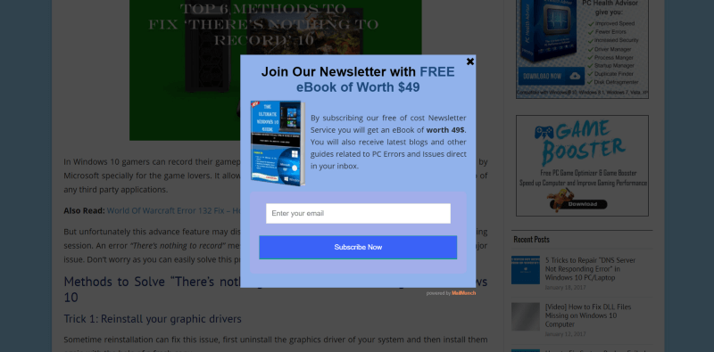
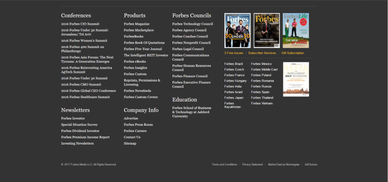

We all know someone that goes a little too far. Driving too fast, buying more than needed, you name it. Unfortunately, it turns out that some websites like to take the same approach lately. Let’s talk about that.

### Absurd animations

We all like some pretty animations, don’t we? Ofcourse it is nice to have so the user knows what’s going on. The progress bar is a good example of an animation that brings value to the user experience. Animating items added to a shopping cart can also help the user understand what’s going on.

You might ask:

> “Well, what’s the problem then?”

That’s where the word ‘too’ comes into play. Some sites like to take this animation thing way too seriously (not to mention jacking the scroll wheel along the way). Take a look at this website’s animations:

Is it cool? Maybe. Is it nice to navigate around and are the objectives clear? Not really. So please, don’t overuse animations. Animate only the necessary things that really supplement the user’s sense of what’s happening on the site. Everything beyond that is just getting in the way of the user.

### Obstructing popups

It was almost too easy to come up with this pain point of a lot of websites. While using Google to find screen capturing software to capture the gif above (yes, I’m a noob), I stumbled upon a site that might have the solution to my problem. You guessed it. I was greeted with this:

Great. Not only does this cover the content I’m interested in, but it also forces me to find a way to be able to get to that content. In addition to that, I don’t know what the site is about if I’m visiting it for the first time either, so how can I know if I would like to subscribe to your newsletter?  
Making the potential reader see this only encourages him or her to get frustrated and press the back button, which means that both parties lose the potential upside.

Atleast give the visitors the option to subscribe AFTER consuming the content if you really can’t stand the urge of trying to lure them into your newsletter. An even better solution is to insert your newsletter sign up form in the footer. Speaking of footer, that’s another place where there’s room for improvement…

### Packed footers

Not all footers are created equal. In my view, footers should be very concise and display only the needed information like business address, contact information and, if needed, a signup form for your newsletter. It’s also possible to put terms of service or something comparable in the footer. For blogs it’s possible to have a few of the latest articles in there as well, but that’s about it. The visitor isn’t looking at the footer as if he or she has to read an article. Forbes, for example, happens to disagree though:

Upon looking at this thing, I got overwhelmed immediately. What should I read first and what information can I get out of this? It being a wall of text doesn’t help either. This is not user friendly at all! Let’s slim that down, shall we?

### Terribly long loading screens

This pain point has a lot to do with the absurd animations discussed above. Sometimes websites have such a lot of animations and effects that the entire website has to have a loading screen. Yeah… so now we have to wait for those fancy animations that are actually not our main goal of visiting the website. Take a look at this:

<em>Loading animation of <a href="http://sectionseven.com/index2.html">Section Seven</a>. (Now offline since I last checked)</em>

Yes, I know this is an old site, but that doesn’t matter. Unfortunately, these animations are also present on more up-to-date websites.

Studies suggest that 40% of people abandon a website that takes more than 3 seconds to load. That is a substantial amount of visitors. Looking at the loading time of websites like the one above can easily result in seeing loading times double that amount. Think about that if you want to get your point across.

### Conclusion

Browsing the internet is fun and all, but sometimes the joy will be ruined by these kind of practices. Let’s just slim that down or forget about it altogether. Not only does this make your site more enjoyable, it also helps the owners get their key point(s) of the website across.

Don’t forget: these are just a few examples of bad practices of websites. There are many more to explore (unfortunately).
