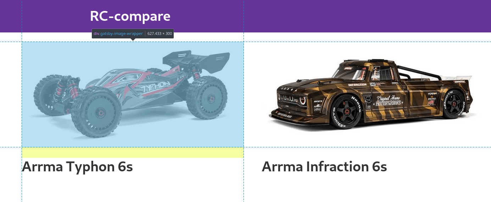

import InfoBox from "../../../src/components/infobox.js"

If you're using Gatsby there's a good chance you've heard of [gatsby-image](https://www.gatsbyjs.org/packages/gatsby-image/).  
It's a useful tool that easily creates speedy, optimized images for you. I struggled with getting fluid images with a fixed height to display nicely though, especially when they have different aspect ratios. This post describes the final solution I came op with.

Before I begin: this article focusses on the 'fluid' option of gatsby-image, which is used for responsiveness. If you know beforehand your images will stay at a fixed height and width, use that option. In practice this rarely happens though, as we live in a world where the amount of different screen sizes keeps growing (think foldable screens on phones).

## Abstracting the gatsby-image component

Normally you'd use a gatsby-image component like this:

```jsx{14}
import React from "react"
import { graphql } from "gatsby"
import Img from "gatsby-image"

export default ({ data }) => (
  <div>
    <h1>Hello gatsby-image</h1>
    
  </div>
)

export const query = graphql`
  query {
    file(relativePath: { eq: "blog/avatars/me.jpeg" }) {
      childImageSharp {
        // Specify the image processing specifications right in the query.
        // Makes it trivial to update as your page's design changes.
        fluid(maxWidth: 125) {
          // a predefined GraphQL fragment defining the fluid image structure
          ...GatsbyImageSharpFluid
        }
      }
    }
  }
```

This way we can only use the component for a single image though. This is the case because we specify a hardcoded string in the GraphQL query.
What you'll ideally want is to pass an image as a prop. That's when this wrapper comes in handy:

<InfoBox type="error">
    Be aware that this solution might not be performant with a large amount of images as it will loop through all files for every instance of the component
</InfoBox>

```jsx
import React from "react"
import { useStaticQuery, graphql } from "gatsby"
import Img from "gatsby-image/withIEPolyfill"

const Image = ({ path, alt = "" }) => {
  const data = useStaticQuery(graphql`
    query {
      images: allFile {
        edges {
          node {
            relativePath
            name
            childImageSharp {
              fluid(maxWidth: 750) {
                ...GatsbyImageSharpFluid
              }
            }
          }
        }
      }
    }
  `)

  const image = data.images.edges.find(n => n.node.relativePath.includes(path))
  if (!image) return null

  return (
    
  )
}

export default Image
```

I know there are quite a few things to unpack here, so let's go through this piece by piece.

```jsx
// The 'useStaticQuery' comes from React Hooks
const data = useStaticQuery(graphql`
  query {
    images: allFile {
      edges {
        node {
          relativePath
          name
          childImageSharp {
            fluid(maxWidth: 750) {
              ...GatsbyImageSharpFluid
            }
          }
        }
      }
    }
  }
`)
```

Here we define a GraphQL query that retreives all images. As GraphQL queries have to be static at build time we can't just pass in the prop with the requested image. We'll have to loop through them ourselves. That's what we do here:

```jsx
const image = data.images.edges.find(n => n.node.relativePath.includes(path))
if (!image) return null
```

The find function is used to search for the image that corresponds to the provided path prop. If no corresponding image is found we return null to prevent gatsby-image from trying to display something with a source of null.

If we do find an image, we can return a gatsby-image component.

```jsx
return (
  
)
```

1. The style prop indicates that the height of the image will always be 300 pixels. This makes sure none of the images is sticking out due to a difference in aspect ratio.
2. the objectFit prop is set to 'contain' in order to scale all non-conforming images in a way that best fits the available screen space.
   The default objectPosition is already "50% 50%" meaning it will try to fit everything to the center as best as possible.
   <InfoBox type="warning">
    For the objectFit prop to work you need to import from "gatsby-image/withIEPolyfill" instead of the regular "gatsby-image"
   </InfoBox>
3. The alt tag is determined by the passed in 'alt' prop. If nothing is passed in it defaults to an empty string.
4. The fluid image source is provided the optimized image from childImageSharp. This is the image that is being shown.

Hopefully this all makes a little more sense to you now!

## Using our gatsby-image wrapper

For this demo I'm going to be using pictures of hobby grade RC cars as I'm a hobbyist myself.
I picked the promotional images of the Typhon 6s and the Infraction 6S from [Arrma RC](https://www.arrma-rc.com/).
These have a resolution of respectively 2000 x 1005 and 1200 x 445 pixels.

Laying out the two images can easily be done with CSS Grid. Make sure your users have a use [a browser that supports grid]([browser support](https://caniuse.com/#search=css%20grid)) though.

```jsx{2,5,10}
<div
  style={{ display: "grid", gridGap: "50px", gridTemplateColumns: "1fr 1fr" }}
>
  <div>
    <Image path="typhon.jpg" alt="Arrma Typhon 6S" />
    <h1>Arrma Typhon 6s</h1>
  </div>

  <div>
    <Image path="infraction.jpg" alt="Arrma Infraction 6S" />
    <h1>Arrma Infraction 6s</h1>
  </div>
</div>
```

The outer most div does all the work of laying the images out correctly.
Again, there are a few important lines of code here:

1. The grid-template-columns definition makes sure both images get the same amount of space (1:1 is a 50% split of space). If you wanted to have the first image take up 2/3rd of the space it'd look like this: "2fr 1fr".
2. gridGap creates 50 pixels of whitespace between the 2 images.
3. The Image component we defined earlier gets passed a reference to the images we want displayed.
   The defined path string is mapped to /src/images by gatsby-source-filesystem which is configured in gatsby-config.js:

```js
module.exports = {
  // ... site metadata etc.
  plugins: [
    // ... other plugins
    {
      resolve: `gatsby-source-filesystem`,
      options: {
        name: `images`,
        path: `${__dirname}/src/images`,
      },
    },
    // ... other plugins
  ],
}
```

With this little bit of code we got the demo up and running! Note that the images always have a maximum height of 300 pixels and are nicely displayed in the center, no matter the aspect ratio.



## Conclusion

Using gatsby-image saves you a lot of time, but sometimes you just need a little more custom functionality. Luckily this is definitely doable with a component like described here. By encapsulating the sizing logic in the Image wrapper component I managed to reduce the total JSX skeleton to only 13 lines. Not bad if I do say so myself.

If you found out a better solution to this problem or used this setup for sites with loads of images (think 300+), I'd love to hear from you! You can get in contact with me [on Twitter](https://twitter.com/VosDevelopment).
