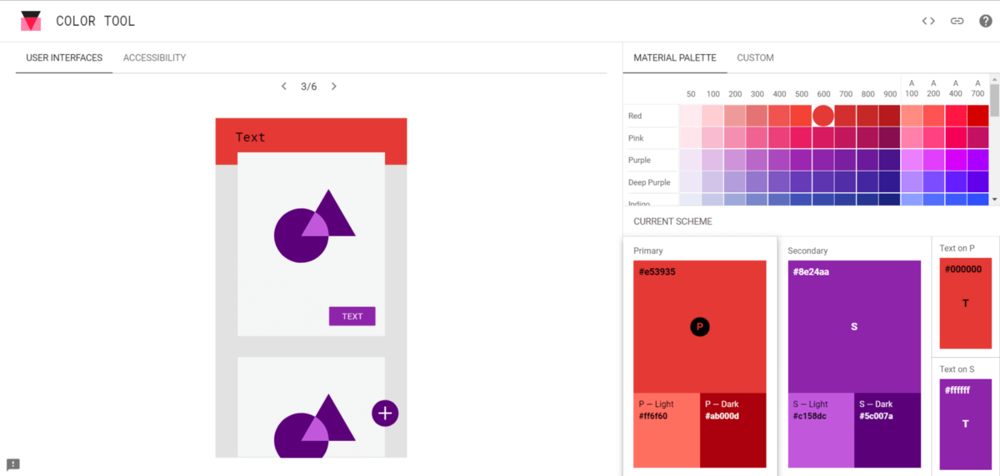
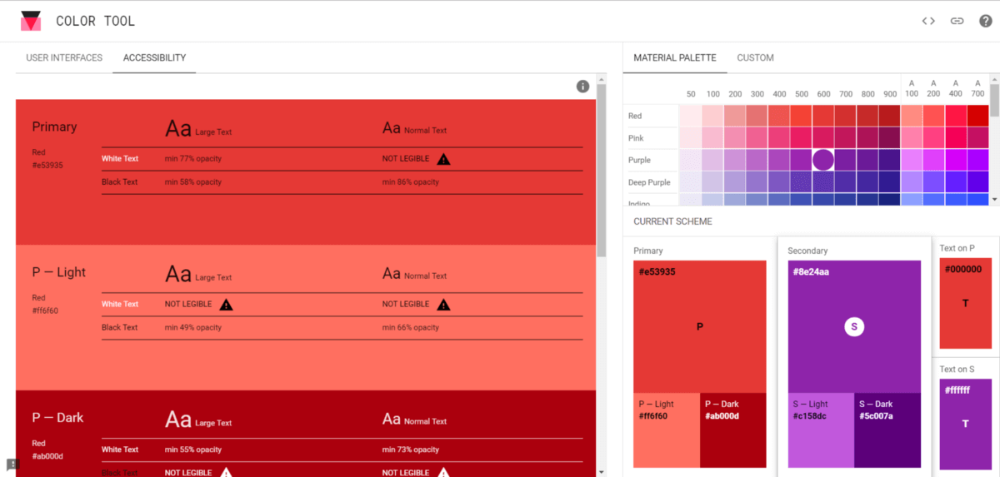
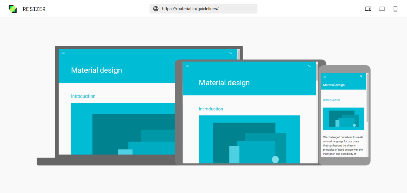
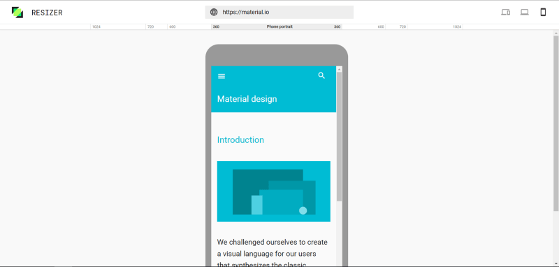
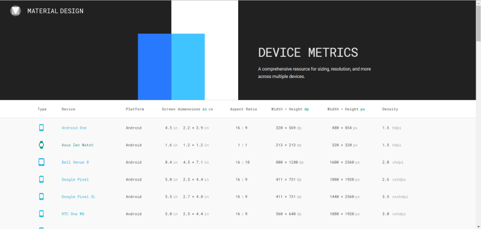

Google’s Material Design is not new anymore. Neither are the articles talking about it. Although a lot has been said about Material Design itself, the tools Google has provided to guide you with using it aren’t put in the spotlight that much. Let’s do something about that.

## Material Design introduction/refresher

Let’s start with a brief introduction/refresher. Material Design was introduced by Google on June 25, 2014 during Google IO.  
The principle behind Material Design relies on making software react more to your inputs and be more seemless while doing so. The design team tried to do so by making the user perceive depth. This could be accomplished by adding just the right amount of shadow and/or lighting to an object on the screen.  
Perceiving depth is not everything though. Every change of the canvas had to be supported by animations, so the user knows what happening. This made sure the user would have a (near) seemless experience.  
For its time, Material Design really was a breath of fresh air.

<iframe width="560" height="315" src="https://www.youtube-nocookie.com/embed/Q8TXgCzxEnw" frameborder="0" allow="accelerometer; autoplay; encrypted-media; gyroscope; picture-in-picture" allowfullscreen />

## Let’s talk tools

It’s time to talk about the tools nobody really talks about now your knowledge of Material Design is fresh. You might be surprised how useful these tools can be.

### Color tool

Material Design comes with some color palettes by default. That already goes a long way towards helping you choose a good color for your project (be it a website or a logo design or something completely different).

But what if you want to use more than one color together? Instead of just having to experiment with it, Google created [a color tool](https://material.io/resources/color/#!/) with which you can visualize the two colors. You can even change the color of the text if you’re so inclined.

The color tool also has an accessibility feature with which you can easily get a report of the readability of your text with the specified colors. It even shows you the minimum opacity it should have to be legible!

### Resizer tool

Before or after the hurdle of choosing the right colors, you may eventually start to think about scaling the application on different devices. But how are you going to test if it works nicely on all devices?

Surprise! Google has you covered here as well. This time with the so called resizer tool.

This tool is extremely easy to use, just like the color tool, which makes it easy for anyone to check if their website is up to snuffs on all sorts of devices. Just put in the URL of whichever website you are trying to investigate and the site will be loaded for you to check!

You can also switch to a laptop or mobile view with the buttons in the top right. This way you can even choose which common width you want the device to have and check if the site performance good enough on all of them.

### Device metric tool

Still, not all devices are created equal. Sometimes you just got to know a little bit more about a specific device to understand why something is not displaying as expected. Aaanndd… _drumroll…_

Google has something for that as well! It’s called device metrics (pretty self-explanatory isn’t it?). You can find the metrics of phones, wearables, laptops and desktop monitors all in one place.

## It’s not all about colors

As you can see, there’s more going on in the background than you might initially think. Making such a big design shift enabled Google to stand out from the rest and elevate the users’ experience on all kinds of devices (especially mobile devices). While doing so they also provided the guidelines to everyone to use in their own projects AND published some tools to help guide you when you’re implementing Material Design yourself. I’d definitely check these tools out!
