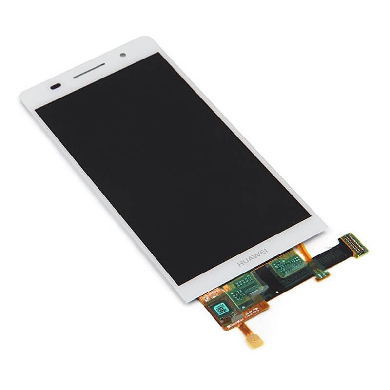
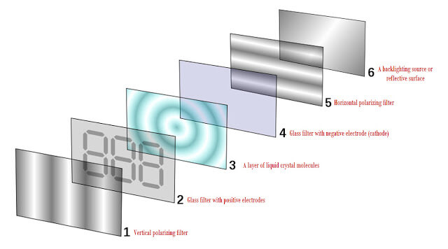
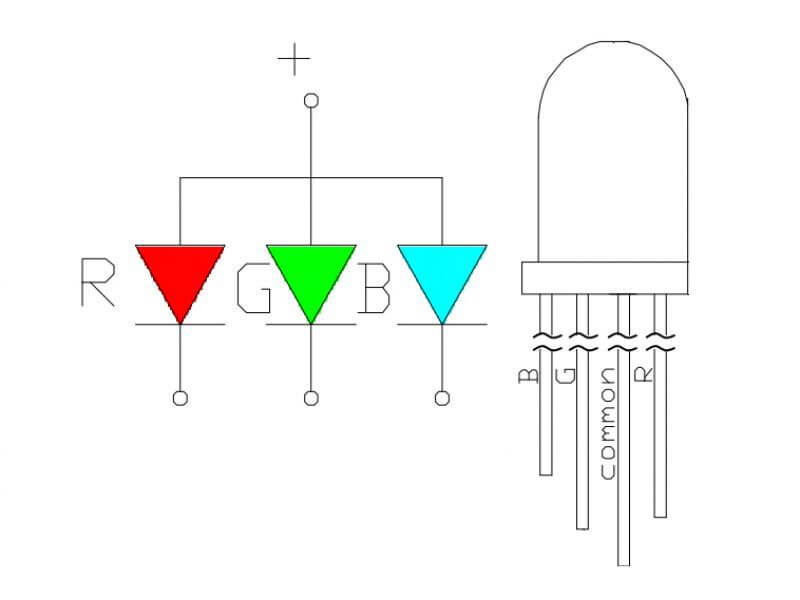

Can you imagine buying a smartphone without a screen? It’s pretty much useless. Most of us stare longer at our smartphone screen than we stare at our TV. So why do most people consider screen quality to be very important when buying a TV but less so when buying a smartphone? Let’s fix that by looking at the screen possibilities and differences when buying a smartphone.

## Display Types

There are two main display types on the market when it comes to smartphones:

1. LCD screens
2. AMOLED screens

These two types are both perfectly capable of displaying a crisp image on your smartphone, but there are a few key differences which you should consider when choosing the technology you want.

### LCD

The abbreviation LCD comes from Liquid Crystal Display. This type of panel relies on backlight as a light source to light your screen up. Most of the time, the color of the LED backlight is blue.

The light first passes through a yellow phosphor coating. After having gone through the phosphor, the light is being polarised and passed through a crystal element. After that, the light goes through a second polarised filter which has a 90 degree angle compared to the first one, just to reduce light bleed and focus on a particular point. A red, green or blue color filter is applied and these sub-pixels are grouped together into pixels, which finally make up the image you see on your screen.

This complete process is developed so that the LCD panel can vary the backlight to change colors instead of needing a colored light in each pixel individually, because this is much more easy and efficient to make.

[Source](https://goo.gl/664CaK)

If you think about it, there’s no difference in power consumption between certain colors on an LCD screen, because of the backlight that needs continuous power. That means that you don’t have to worry about a specific color eating into your battery life more than others. More on that in the AMOLED section.

Generally speaking, the technology tends to be more life-like than AMOLED screens as well. An LCD display can show cleaner colors and less saturated reds, greens and blues. Important to know for some, less so for others.

### AMOLED

This screen technology is actually quite different from LCD. AMOLED screens are not based on a backlight, but on (you guessed it) LEDs. These LEDs are much smaller than your standard LEDs and are arranged in clusters of red, green and blue. Together, they form a single pixel on your display. Differentiating the colors of the individual pixels makes up the image you see on your phone screen.

Just like the LCD panel, the white is made up of different colors (in this case the red, green and blue of the LEDs). You might be asking:

> Why do we have to emulate white light though?

The color white can only be made when combining all existing colors together. Therefore it is not possible to put in a white LED and be done with it.

If you want to have a realistic white color, you have to balance all the colors perfectly. The emulation of that white light isn’t always perfect though. Manufacturing differences can even make the panels differ from one device to another. That said, it’s very likely that you will not notice this emulation, because of the improvement in display technology over the last couple of years and the precision with which the white light can be emulated. Hooray!

[Source](https://goo.gl/XkjJ8e)

> How can AMOLED have such good blacks though?

The LEDs of an AMOLED panel are powered by the current that is provided to them. Shining LEDs = a happy viewer! That also means that you can get deep blacks with an AMOLED screen, by simply stopping the current from going to the LEDs. You can safe some battery while enjoying the deep blacks as well, as no energy is used when the LEDs are off! An LCD screen, on the other hand, still has to draw power when displaying black because of the backlight.

Another plus for AMOLED is that the screen consists of very little layers on top of each other, which results in a relatively thin screen. This is ideal for mobile devices, because of the tiny amount of space engineers usually have to work with. This space can, for example, be reused to house a bigger battery. The lack of rigid backlight (one of the layers in an LCD screen) makes it an opportunity for foldable displays to get developed as well, but that’s still quite far away for consumers.

It’s not all fun and games though. AMOLED screens can suffer from screen burn in. This means that it’s possible that the color might ‘stick’ to the screen after displaying a static color for a long time. This is better known on TV’s with channel logos ‘sticking’ in the corner of the screen. The content on phones changes regularly enough though, so it’s less likely to be a problem.

Unfortunately, AMOLED screens also tend to be a little oversaturated. The blue, red and green colors are more pronounced than LCD screens, which can result in photos looking fake. This doesn’t mean it isn’t pretty to look at. On the contrary, our eyes generally like a more saturated look better, but you should always have a look yourself to make sure it’s your taste. On some phones the saturation is borderline absurd.

## The bottom line

Overall, AMOLED has more advantages than LCD, but in the end it’s all about preference when choosing a display technology. Do you want a life-like display? Go with LCD. Want something more punchy with deep blacks? Go with AMOLED.

In this day and age smartphone manufacturers tend to lean more towards the AMOLED side for aforementioned reasons, although LCD certainly has some positives as well. I’d definitely recommend going out and looking at both display technologies so you can judge for yourself.
