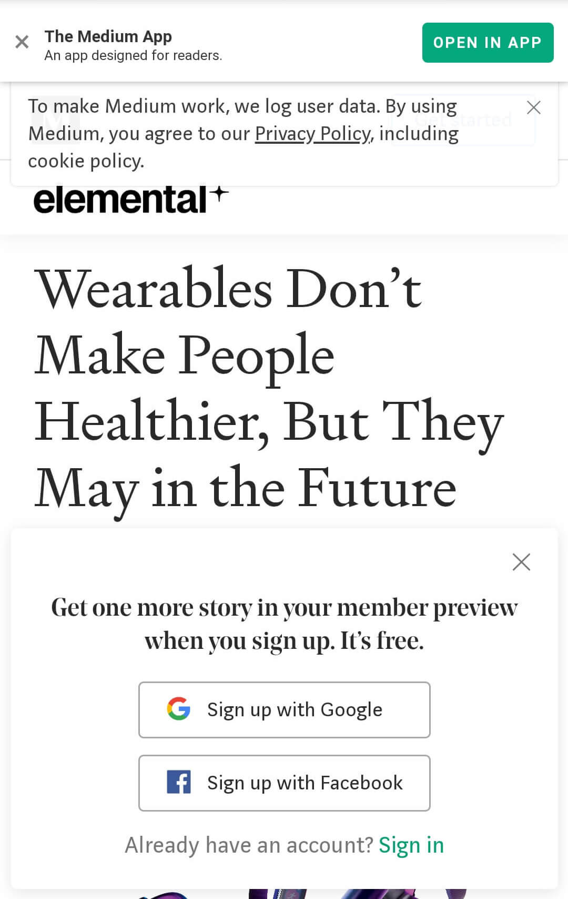
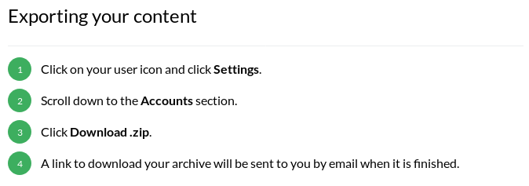

In this day and age Medium is not the only way of hosting your blog posts.  
There's a good chance you don't think the hassle of switching is worth it though.
In this post I dissect how easy it actually is to jump ship and why it matters.

## Why move off Medium?

Lately the resistance against Medium has grown, and for good reasons.  
These are the 2 main ones that made me choose my own blogging solution over Medium:

### 1. Obnoxious popups

Obnoxious popups and installation requests are shown before visitors can even read your post.
Yet the attention span of people on the internet is small.  
On the daily we get bombarded by information from various sources.
If it's too much information we are quick to leave.

Take a look at this:



You get the point, right?

### 2. (Practically) no control

Medium can change functionality whenever they see fit, without you having any control over it.
If you don't like it you're pretty much out of luck. The same goes for layout and visuals.

As a resultof Medium's control there's no way to truly stand out. Every blog has the same UI building blocks.
Yes, you can change a logo and you might even be able to change an accent color somewhere, but that's about it.
When you have your own platform you can customize it to your hearts content as it's your own code.

## How I moved over

So, how do we actually make work of this? Talking about moving is one thing, but actually doing it is another.
Luckily this is not as hard as you might think!

### The core

I decided to go with [Gatsby](https://www.gatsbyjs.org/) because of my past experiences with it and my knowledge of its foundation: React.
A great template I used for getting up and running fast is [Gatsby Blog Starter](https://github.com/gatsbyjs/gatsby-starter-blog).
Getting up and running with it is as easy as opening a command prompt in your desired directory and typing

```bash
  npx gatsby new NAME_OF_BLOG_HERE https://github.com/gatsbyjs/gatsby-starter-blog
```

Once you've got the template set up you should change a few of its defaults to personalize your blog.  
This includes but is not limited to:

- Changing the biography information and profile picture in `src/components/bio.js`
- Updating site metadata in `gatsby-config.js`
- Changing options and most notably the theme_color property of `gatsby-plugin-manifest` in `gatsby-config.js`
- Updating auther, description, keywords etc. in `package.json`
- Giving the 404 page in `src/pages/404.js` your own flair
- Updating the SEO information in `src/components/seo.js` and possibly add open graph and twitter image card support
- Changing fonts when you feel like it (I haven't at the time of writing)

[Dan Abramov](https://twitter.com/dan_abramov?lang=en)'s open source blog [Overreacted](https://overreacted.io/), which is built with the Gatsby Blog Starter, was also of great help for some rad features like an estimated time-to-read and autolinking headers for quick reference.  
To be clear, using code from Dan's blog is by no means necessary to get your blog working.
I just happened to find some features too attractive to pass up.

### The content

This is where your blog is going to actually take its shape. After all, what is a blog without content?
To make creating this content as easy as possible Gatsby automatically populates your blog's pages using the default `gatsby-node` config and `gatsby-transformer-remark`.  
That's right, you write blog posts in Markdown! This means you can also spice things up with a bit of HTML + CSS.
If you want to go full ham you can also opt for [mdx](https://mdxjs.com/) with which you can add JSX directly into your Markdown.  
The sky is the limit!

Speaking of limit, the biggest thing that's holding people back is the amount of effort it normally takes to transfer old blogs to the new one.  
Luckily Medium has an export function which provides you with all your previous posts.
You can get ahold of your information like this:



What you'll find inside the ZIP file is a set of HTML files. These have to be converted to Markdown to be useful in our current system.
[medium-2-md](https://github.com/gautamdhameja/medium-2-md) to the rescue!

As we already have the archive in a local directory we'll be using the convertLocal option of `medium-2-md`:

```bash
  npx medium-2-md convertLocal '<path of the posts directory>' -dfi
```

When you include the `i` flag you ask to also pull down the images in your blog posts, which might be a welcome surprise.
[Here's](https://github.com/gautamdhameja/medium-2-md#optional-flags) a full explanation of the flags if you're interested.  
Also, did you notice the use of npx? This way we don't have to globally install the package as we're only using it this one time.

Now unfortunately not every conversion goes smoothly in my experience. Some headings might have the wrong type or quotation styling might be missing, but I did correctly get the actual text. Besides, it's always a good idea to check the formatting before putting the posts back online.

### Publishing

Now comes the final step in our journey: publishing the thing.
Since Gatsby is a static site generator it produces plain HTML, CSS and JavaScript which makes it run pretty much anywhere!

Personally I decided to go with [Netlify](https://www.netlify.com/) as I had great experiences quickly setting up a website before.
A big advantage of Netlify is that you don't even have to build the site yourself! Just link Netlify to your GitHub, hook up your custom domain and you're good to go. Want a preview before everything goes live? No problem. Netlify automatically generates live preview URL's for merge requests.

I hope you at least consider playing around with creating your own blog next time you have some downtime.
Feel free to check out [the source code of this blog](https://github.com/martijnvos/martijnvos.dev/) if you want to dive in a little deeper.
Now relax, enjoy and blog away!
