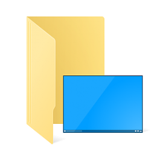

<figure style="text-align: center;">
  
  <figcaption>
    <a href="https://www.tenforums.com/geek/gars/images/2/types/thumb__esktop_folder.png">Source</a>
  </figcaption>
</figure>

In operating systems like Windows and macOS it's perfectly normal to have a Desktop directory. That's where we can put everything that we want quick access to or think doesn't belong in any other folder like Downloads, Documents etc.

When using window managers such as [i3wm](https://i3wm.org/), [dwm](https://dwm.suckless.org/) and [bspwm](https://github.com/baskerville/bspwm) it's a different story. With these, the notion of a Desktop directory is non-existent. "That's easy, let me just delete it", I thought at first. Fast-forward a few days and I was suprised to notice the directory was created again!

## When is ~/Desktop created?
After some research it seemed probable that the directory is created when a save dialog from a browser pops up. It turns out the entries for this dialog are determined by the [XDG Base Directory Specification](https://specifications.freedesktop.org/basedir-spec/basedir-spec-latest.html). This specification dictates one or more base directories relative to which files should be located. And what do you know, the Desktop directory is defined as `~/Desktop` by default.

By reading up on the spec it became clear that the save dialog is not the only situation in which this directory gets (re)created. The same happens [at every login](https://freedesktop.org/wiki/Software/xdg-user-dirs/).

## How to get rid of it for good?
Now that we know when and why the directory is created we can actually do something about it.

By altering the `XDG_DESKTOP_DIR` entry we'll get rid of that pesky Desktop folder for good. What do we replace the default with though? I ended up with `$HOME` (which is an environment variable for `/home/{user}/`) as this directory always exists and is the closest match to the traditional Desktop directory.

Persisting this configuration can be done in a file called `user-dirs.dirs` in the `~/.config` directory (this is the default for `XDG_CONFIG_HOME`).

```sh
XDG_DESKTOP_DIR="$HOME/"
```

In here you can specify more than just the Desktop directory. These other settings are summed up nicely in [the arch wiki](https://wiki.archlinux.org/index.php/XDG_user_directories).

## Closing thoughts
Although this wasn't as trivial as I first expected it didn't turn out to be hard either. Having a central place to define the default directory locations is actually nice to have for customizability. Since this is setup specific configuration I encourage you to add this to your dotfiles repo, [just like I did](https://github.com/Martijnvos/dotfiles/blob/master/.config/user-dirs.dirs).