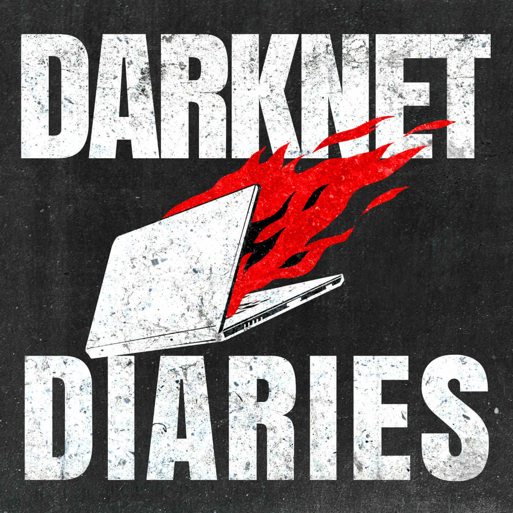

Since last year my podcast consumption has increased exponentially as I have to travel an average of around 3 hours a day during weekdays.
After such periods of time, sitting in the train and scrolling through Twitter and Reddit is getting quite dull.
Besides, I'm already looking at a screen for most of my day so I love to look out of the window during those train rides.
That's exactly where these podcasts come into play. They can be consumed everywhere, paused, skipped through and best of all don't require visual attention.

## The podcast app I use

The base of a good podcast experience is the app with which you listen to them.
With the increase of my podcast consumption I decided it was time to up that 'app game'.
The app that did it for me turned out to be [Pocket Casts](https://www.pocketcasts.com/), which is now free (yay).

So why did I choose Pocket Casts? Mostly because of its great reviews, clean look and organized podcast overview screen.
The nice animations couldn't hurt though. After experiencing the app doesn't get in the way I was completely convinced, because that's what ultimately matters the most.

## The podcasts themselves

On to the podcasts themselves. That's what you're here for after all!  
Remember that these are my currently most listened to podcasts.
If you know others that you'd strongly advise me to check out I'd love to hear from you over on [Twitter](https://twitter.com/VosDevelopment).

### Sytax.fm

[Syntax](https://syntax.fm/) is one of the first podcasts I started listening to and still tops the charts for best ad segways.
Wes and Scott are great in mixing their sense of humor with interesting topics and blending their excellent explanation skills.
The podcast is usually split up into 2 episodes a week with Monday being a 'Hasty Treat' ranging from 15 to 30 minutes and wednesday being a full blown episode around the 1 hour mark. Syntax mostly focusses on front-end development, but also contains some general business and life related topics. Lets also not forget about the 'Sick Picks' at the end of every full episode in which Wes and Scott decide on a service/product they recommend. From a lawnmower to a security camera, nothing's off limits.

### Indie Hackers Podcast

[The Indie Hackers podcast](https://www.indiehackers.com/) brings you the stories and experiences of business owners that grew their idea into profitable internet businesses. In the show, Courtland Allen tries to dissect how exactly the guests managed to do that. In his own words:

> I try to get a sense of what it's like to be in their shoes.  
> How do they get to where they are today? How do they make decisions, both at their companies and in their personal lives, and what exactly makes their businesses tick?

I find this podcast particularly interesting because Courtland isn't scared to ask very specific questions. This avoids the regular 'boring' questions.
Ofcourse, a brief history of the company is always given, but I find that he doesn't spend unnecessarily long on that topic.
At the end the guest is always asked to give advice to (aspiring) entrepreneurs, which makes for a nice conclusion to the on average 1 to 1 and a half hour long podcast.

### Masters of Scale

Every episode of [the Masters of Scale podcast](https://mastersofscale.com/) is based on a certain belief of Reid Hoffman, the host.
During the episode the reasoning behind this belief begins to unfold as the guest tells his/her story.

This particular podcast peaks my interest because of the great storytelling with several audible representations of situations sprinkled throughout.
If there's an analogy with battle for example, the sound of clanging swords would be played in the backround. This makes for a way more immersive experience than regular talking. The show can be compared to the Indie Hackers podcast because of its interviewing of (mostly technical) business owners. The twist here is that the guests tend to run bigger businesses, as the name suggests.

In my opinion this podcast is well worth the 30 minutes to 1 hour of your listening time!

### Darknet Diaries

[Darknet Diaries](https://darknetdiaries.com/) episodes are centered around 'true stories from the dark side of the internet'.
Jack Rhysider, the host of the podcast, interviews people that have stories about or connected to hacking.
The roles of the guests in the stories vary quite drastically: from white/black hat hacker to security specialist to social engineer, I've heard it all and more.
Most episodes revolve around a single story, but once in a while Jack publishes an episode with a couple stories that aren't worthy of a full episode of their own. Due to the variety in stories and guests the episodes vary in length from half an hour to 1 and a half hours.

I find that Darknet Diaries is one of those podcasts that totally immerse you in the story. Jack's great narration combined with the carefully crafted storyline make it a great podcast to listen to when you want to relax. I still find myself learning quite a bit though, as he likes to dive deeper into technicalities every now and then.

### The Ground Up Show

Being produced by a filmmaker called Matt D'Avella, [The Ground Up Show](https://mattdavella.com/podcast) might seem like a misfit compared to all the technical podcasts listed above. It's not all about filmmaking though, not at all.

> I’m a filmmaker, YouTuber & podcaster that explores what it means to live a good life
> ~ Matt D'Avella

In his podcast Matt focuses on the essence of life and how we can improve it. He partly does this by embracing minimalism, the act of making decisions based on what you need instead of getting everything you want.  
The combination of his interesting guests, great questions and timely sense of humor make the podcast a must listen.
As his cinematography is on point I'd also recommend you check to out [his videos on YouTube](https://www.youtube.com/mattdavella)!

P.S. Matt, if you read this: I look forward to the day I see the episode with the Rock air!

## That's it!

Those are the podcasts I listen to the most at the moment.

During the creation of this blog posts I came across another potentially interesting podcast called [Scale or Die](https://useproof.com/scaleordie).
This one seems to fall into the same category as Indie Hackers and Masters of Scale. I'm excited to give it a listen and will report back over on [Twitter](https://twitter.com/VosDevelopment).
