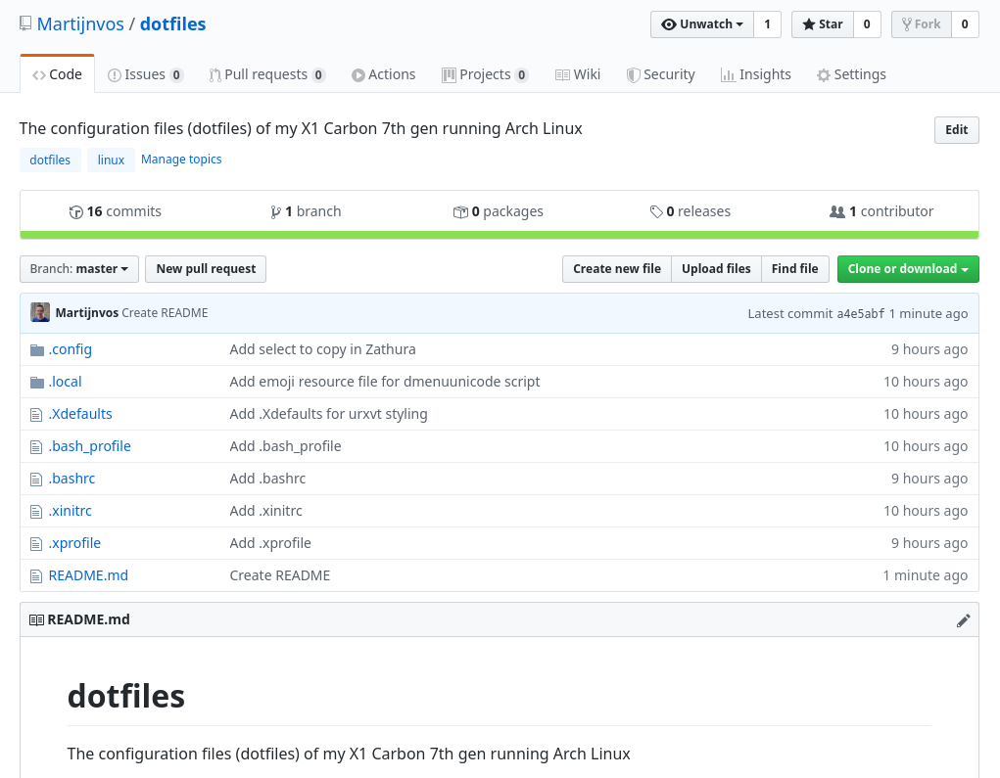

Dotfiles are the foundation of your Linux configuration. Pushing them to a remote Git repository will make it easy to set up other distro's in the future. No more reconfiguring everything by hand. Just clone your repository and you're off to the races. In this blog post I'll show you my configuration which makes use of a bare Git repository. Let's take a look!

# What's a bare Git repository?
A bare repository does not contain files other than the files Git requires to work. Normally these Git configuration files would go in a hidden directory named```.git```. In the case of a bare repository they are created in the root of the folder where you initialize the repository.  
This means that you'll see ```YOUR_REPO_FOLDER/``` instead of ```YOUR_REPO_FOLDER/.git``` like you're used to.

A bare repository can be viewed as a local reference point with which you can push the various configuration files to your preferred git provider. The location of staged and commited files can't be equal to the reference point though.

# Configuring your dotfiles repository

<div style="color: #856404; background-color: #fff3cd; border-color: #ffeeba; padding: .75rem 1.25rem; margin-bottom: 1rem; border: 1px solid transparent border-top-color: transparent; border-right-color: transparent; border-bottom-color: transparent; border-left-color: transparent; border-radius: .25rem;" role="alert">
  This section assumes you've created a remote repository and have the corresponding URL within reach.
</div>

Configuring a bare repository can be done very quickly and elegantly. Only 5 console commands have to be executed in order to get all of this to work (ignore the numbering).

```bash
# Create the directory for your bare repository
1. mkdir ~/.dotfiles

# Initialize a bare repository in the directory you just created
2. git init --bare ~/.dotfiles

# Create a Git alias that references the Git dotfiles repository and the local root directory from which Git adds files by default
3. alias dotfiles='/usr/bin/git --git-dir=$HOME/.dotfiles --work-tree=$HOME'

# Configure the dotfiles bare repository to hide untracked files
4. dotfiles config status.showUntrackedFiles no

# Add the remote location to the repository (in this case GitHub) 
5. dotfiles remote add origin https://github.com/$USERNAME/$REPOSITORY.git
```

In order to explain everything a little more I added some extra remarks per command:

1. You can name the directory whatever you want as long as you stay consistent when initializing the bare git repository. Don't forget to update the ```--git-dir``` value of the ```alias``` command as well!

2. Don't ever add files to ```~/.dotfiles``` (or the name you gave it). This folder is purely meant for the bare repository. The next command determines the default work tree location of Git from which you track files.

3. Always keep in mind files are added relative to the --work-tree path. Most config files live in ~/.config so in my case those are referenced with ```.config/```. Absolute paths work too (e.g. ```~/.config/```).

4. Hiding untracked files is strongly recommended. If you don't, Git will show all the unadded files from the work tree directory. That includes all your documents and downloads in the example above, which makes things messy VERY quickly!

5. In order to save the dotfiles online you'll hook the local repository up to the remote one. This can be any service you like (GitHub, GitLab, BitBucket, etc).

# Configuring .bashrc

## Why
.bashrc is a shell script that runs whenever bash is started interactively. It's recommended to put the ```alias``` command mentioned above in this file. 
This will make sure the ```alias``` is loaded in every command prompt you open. When you don't define the ```alias``` it will not work the next time you open a terminal or reboot your computer. In my example that would mean that ```dotfiles``` will not be recognised as a command.

## How
Open the ~/.bashrc file in your favourite editor. Make sure to add ```sudo``` as writing to this file requires root permission. Once you're in, simply copy and paste line 3 (the one with ```alias```) and save the file.
Try re-logging / rebooting if it doesn't work right out of the gate.

# Using all of this
You're all set up. Yay 🎉
Now is the time to add some dotfiles to your repository!

Let's take my [i3](https://i3wm.org/docs/userguide.html) configuration file as an example. This file describes all the settings and keyboard shortcuts of the popular i3 tiling window manager.  
Adding it to Git is now as easy as running ```dotfiles add ~/.config/i3/config``` (assuming your alias is called dotfiles). Don't forget to add a commit message (```dotfiles commit -m "YOUR MESSAGE"```) and push it up to your remote repository (```dotfiles push origin master```) to finish it all off.

Ofcourse you can also do this with folders themselves. If I wanted to commit all the i3 config files I'd use ```dotfiles add ~/.config/i3``` before defining the commit message.

You're now set up to continue adding dotfiles to your repository!

# Importing the dotfiles
Uploading your dotfiles is one thing, but knowing how to set them up is important too. Luckily this is not hard to do. It's just this one-liner:

```bash
git clone --separate-git-dir=~/.dotfiles https://github.com/$USERNAME/$REPOSITORY.git ~
```
This will clone the contents of the remote repository (the .git link) to the home directory (~) while referencing ```~/.dotfiles``` as the local bare repository (the --seperate-git-dir part).

<div style="color: #721c24; background-color: #f8d7da; border-color: #f5c6cb; padding: .75rem 1.25rem; margin-bottom: 1rem; border: 1px solid transparent border-top-color: transparent; border-right-color: transparent; border-bottom-color: transparent; border-left-color: transparent; border-radius: .25rem;" role="alert">
  Your home directory should not contain any configuration files that are present in your remote repository. Make sure to check all files and save important information before removing them.
</div>

Don't forget to rerun command 3 (if you want to stay in the current terminal) and 4 of the [configuration section](#configuring-your-dotfiles-repository) before trying to update the remote with your locally changed files.

# Go ham!
You now know how I manage my dotfiles without too much fuss. I'm still very new to Linux in general so if there's a better way to do this I'd love to know.

Credit for this method goes to [StreakyCobra's Hacker News comment](https://news.ycombinator.com/item?id=11070797), which is also referenced in the [Arch Wiki article on dotfiles](https://wiki.archlinux.org/index.php/Dotfiles#Tracking_dotfiles_directly_with_Git). 
Honorable mention to the [Atlassian blog post](https://www.atlassian.com/git/tutorials/dotfiles) of [Nicola Paolucci](https://twitter.com/durdn) which explains this concept as well.

As always, thank you for reading!  
If you're interested in my dotfiles you can find them [here](https://github.com/Martijnvos/dotfiles/tree/master)