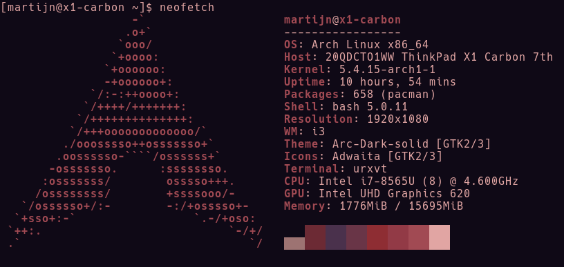

I ended my [last post](https://martijnvos.dev/a-few-issues-i-encountered-on-linux-kernel-5.4.2/) with the following:

> Keep your eyes peeled for some Arch Linux installation & configuration notes coming to you shortly!

Well, it obviously didn't age well considering that was posted December 11th last year. Better late then never though, let's dive in!



<div style="color: #856404; background-color: #fff3cd; border-color: #ffeeba; padding: .75rem 1.25rem; margin-bottom: 1rem; border: 1px solid transparent border-top-color: transparent; border-right-color: transparent; border-bottom-color: transparent; border-left-color: transparent; border-radius: .25rem;" role="alert">
    This blog post will only discuss the packages I use thus far. I'm planning on writing separate posts about configuring them.
</div>

## Staring into the dark (quite literally)

When you have just installed [Arch Linux](https://www.archlinux.org/) the system is completely free of unnecessary programs/packages. You'll be dropped off in [a TTY](https://wiki.archlinux.org/index.php/getty), without a graphical user interface like a [desktop environment](https://wiki.archlinux.org/index.php/Desktop_environment) (think Gnome or KDE, etc.) or even a [window manager](https://wiki.archlinux.org/index.php/window_manager) (i3, bspwm, etc.).

While that might seem jarring to you at first, it also means that you have full control over the installation and can customize it to your heart's desire. That's what makes Arch Linux so interesting.

Note that all of the links I used above point to the Arch Wiki. This is **THE** place to be for all your questions. The carefully crafted pages will let you know exactly what's possible and/or necessary for the topic at hand. Even more importantly: due to the sheer amount of documentation you'll pretty much always find what you're looking for.

## Some assumptions
This post assumes you have installed Arch Linux and know at least the basics of package management. Seeing that you managed to get Arch Linux working there's a good chance you already know that kind of stuff.

As this setup is made by and specifically for myself I can't guarantee that everything I describe here is your cup of tea. Don't take this as gospel, tackle challenges gradually and make sure you understand core concepts before moving on.

Regarding sudo: always ask yourself the question ['What would sudowoodo do?'](https://audreyxie.com/2020/sudowoodo-reminding-you-to-be-careful-when-using-sudo/)

## Show me your packages already!  

There are quite a few packages here, so I separated them into sections in an attempt to make them easier to glance over. 

<div style="color: #004085; background-color: #cce5ff; border-color: #b8daff; padding: .75rem 1.25rem; margin-bottom: 1rem; border: 1px solid transparent border-top-color: transparent; border-right-color: transparent; border-bottom-color: transparent; border-left-color: transparent; border-radius: .25rem;" role="alert">
    If you think something is missing or you have a suggestion, I'd love for you to get in contact!
</div>

### The essentials

It's been around 2 months since I first started using Arch Linux on my laptop. The dust has settled and the honeymoon phase is beginning to wear off a bit. During this time I've noticed the importance of a few of the packages I installed. These are the ones I'd reinstall immediately if I had to start from scratch:

| Type / Functionality              | Name                                                        | Package                                                                                                                                                                                                                                                                                                                              | AUR | Remarks                                                                                                                                 |
|-------------------|-------------------------------------------------------------|--------------------------------------------------------------------------------------------------------------------------------------------------------------------------------------------------------------------------------------------------------------------------------------------------------------------------------------|-----|-----------------------------------------------------------------------------------------------------------------------------------------|
| Clipboard         | xclip                                                       | [xclip](https://www.archlinux.org/packages/extra/x86_64/xclip/)                                                                                                                                                                                                                                                                      |     |                                                                                                                                         |
| Statusbar         | Polybar                                                     | [polybar](https://aur.archlinux.org/packages/polybar/)                                                                                                                                                                                                                                                                               | x   |                                                                                                                                         |
| Lockscreen        | Betterlockscreen                                            | [betterlockscreen](https://aur.archlinux.org/packages/betterlockscreen/)                                                                                                                                                                                                                                                             | x   | Does double duty by looking nice                                                                                                        |
| Notifications     | Dunst libnotify                                             | [dunst](https://www.archlinux.org/packages/community/x86_64/dunst/) [libnotify](https://www.archlinux.org/packages/extra/x86_64/libnotify/)                                                                                                                                                                                          |     | Lightweight notification daemon/server An implementation of the  Desktop Notifications Specification, requires server/daemon like Dunst |
| Background setter | feh                                                         | [feh](archlinux.org/packages/extra/x86_64/feh/)                                                                                                                                                                                                                                                                                      |     |                                                                                                                                         |
| Screenshots       | scrot                                                       | [scrot](https://www.archlinux.org/packages/community/x86_64/scrot/)                                                                                                                                                                                                                                                                  |     |                                                                                                                                         |
| File manager      | GUI: PCManFM Terminal: nnn                                  | [pcmanfm](https://www.archlinux.org/packages/community/x86_64/pcmanfm/) [nnn](https://www.archlinux.org/packages/community/x86_64/nnn/)                                                                                                                                                                                              |     |                                                                                                                                         |
| Media player      | mpv                                                         | [mpv](https://www.archlinux.org/packages/community/x86_64/mpv/)                                                                                                                                                                                                                                                                      |     |                                                                                                                                         |
| Fonts             | Hack Noto Symbola                                           | [ttf-hack](https://www.archlinux.org/packages/extra/any/ttf-hack/) [noto-fonts](https://www.archlinux.org/packages/extra/any/noto-fonts/) [ttf-symbola](https://aur.archlinux.org/packages/ttf-symbola/)                                                                                                                             |   x |   Handy for Unicode support                                                                                                             |
| Terminal emulator | rxvt-unicode st                                             | [rxvt-unicode](https://www.archlinux.org/packages/?name=rxvt-unicode) [st](https://aur.archlinux.org/packages/st/)                                                                                                                                                                                                                   |  x  |  I plan on trying st in the foreseeable future                                                                                          |
| PDF reader        | Zathura zathura-pdf-mupdf                                   | [zathura](https://www.archlinux.org/packages/community/x86_64/zathura/) [zathura-pdf-mupdf](https://www.archlinux.org/packages/community/x86_64/zathura-pdf-mupdf/)                                                                                                                                                                  |     |                                                                                                                                         |
| Sound server      | Pulseaudio Pulseaudio ALSA Pulseaudio Bluetooth Pavucontrol | [pulseaudio](https://www.archlinux.org/packages/extra/x86_64/pulseaudio/) [pulseaudio-alsa](https://www.archlinux.org/packages/extra/any/pulseaudio-alsa/) [pulseaudio-bluetooth](https://www.archlinux.org/packages/extra/x86_64/pulseaudio-bluetooth/) [pavucontrol](https://www.archlinux.org/packages/extra/x86_64/pavucontrol/) |     |   Needed for pairing bluetooth devices Volume control GUI                                                                               |
| Brightness        | xbacklight                                                  | [xorg-xbacklight](https://www.archlinux.org/packages/extra/x86_64/xorg-xbacklight/)                                                                                                                                                                                                                                                  |     |                                                                                                                                         |
| Generic menu      | dmenu                                                       | [dmenu](https://www.archlinux.org/packages/community/x86_64/dmenu/)                                                                                                                                                                                                                                                                  |     | Can be used for pretty much anything, from mounting drives to launching applications and running scripts. You name it.                  |
| Network manager   | NetworkManager                                              | [networkmanager](https://www.archlinux.org/packages/extra/x86_64/networkmanager/)                                                                                                                                                                                                                                                    |     | Contains nmtui for switching WiFi networks in terminal                                                                                  |

### System maintenance
Keeping the system in tip-top shape is of great importance. Not only does it reduce the amount of resources used, it also makes sure you have a good overview of what different parts of your configuration do. Once junk files start to pile up you quickly lose track.

These are the tools I use for keeping everything up-to-date and clean:

| Type / Functionality                          | Name     | Package                                                              | AUR | Remarks                                                                                    |
|-------------------------------|----------|----------------------------------------------------------------------|-----|--------------------------------------------------------------------------------------------|
| Firmware updates              | fwupd    | [fwupd](https://www.archlinux.org/packages/community/x86_64/fwupd/)  |     | Command line tool for LVFS updates                                                         |
| Pacman wrapper and AUR helper | yay      | [yay](https://github.com/Jguer/yay)                                  | x*  | *If you have another AUR helper you can install Yay from there. Build from source otherwise |
| Partition manager             | GParted  | [gparted](https://www.archlinux.org/packages/extra/x86_64/gparted/)  |     |                                                                                            |
| GUI directory tree analyzer   | baobab   | [baobab](https://www.archlinux.org/packages/extra/x86_64/baobab/)    |     |                                                                                            |
| USB                           | usbutils | [usbutils](https://www.archlinux.org/packages/core/x86_64/usbutils/) |     | Useful for commands like 'lsusb'                                                           |
If you want to know more about maintenance [the Arch Wiki's excellent writeup](https://wiki.archlinux.org/index.php/System_maintenance) is a great place to start.

### Development
Now that we've got a stable system (or at least think we do) we can move on to actually creating with it. For that I had to install a few languages with their corresponding tools,

**Languages**  
```
|
└───JavaScript
│   │   NodeJS, which includes npm
│   
└───C#
|   │   dotnet-runtime
|   │   dotnet-sdk
|   |   dotnet-host
│   
└───Python
|   │   python
|   │   python-pip
│   
└───Java / Kotlin (Android)
    │   android-udev
    │   android-tools
    |   android-emulator
    |   android-studio
    |   jdk8-openjdk

```

<div style="color: #856404; background-color: #fff3cd; border-color: #ffeeba; padding: .75rem 1.25rem; margin-bottom: 1rem; border: 1px solid transparent border-top-color: transparent; border-right-color: transparent; border-bottom-color: transparent; border-left-color: transparent; border-radius: .25rem;" role="alert">
    Keep in mind that your configuration might vary wildly depending on the work you do. Don't just install this for the sake of it.
</div>

**Tools**

One of the greatest assets of a programmer are the tools. These are the basic ones I'd recommend having installed:

| Type / Functionality            | Name                    | Package                                                                                                                                                  | AUR | Remarks                                                                                     |
|------------------|-------------------------|----------------------------------------------------------------------------------------------------------------------------------------------------------|-----|---------------------------------------------------------------------------------------------|
| Version Control  | Git                     | [git](https://www.archlinux.org/packages/extra/x86_64/git/)                                                                                              |     |                                                                                             |
| Editor           | Visual Studio Code Nano | [code](https://www.archlinux.org/packages/community/x86_64/code/) [nano](https://www.archlinux.org/packages/core/x86_64/nano/)                           |     |  Used for smaller edits like config files                                                   |
| Containerization | Docker Docker Compose   | [docker](https://www.archlinux.org/packages/community/x86_64/docker/) [docker-compose](https://www.archlinux.org/packages/community/any/docker-compose/) |     |  Running compose files containing orchestration instructions for multiple docker images |
| REST client      | Insomnia                | [insomnia](https://aur.archlinux.org/packages/insomnia/)                                                                                                 | x   |                                                                                             |
| FTP              | FileZilla               | [filezilla](https://www.archlinux.org/packages/community/x86_64/filezilla/)                                                                              |     |                                                                                             |

### Ricing
While you're at it, why not make your setup look pretty? If we look at our screens for a substantial amount of hours per day it can't hurt to spice it up a little. In my setup I'm aiming for the perfect balance between efficiency and beauty by leveraging minimalism.

| Type / Functionality                     | Name                                         | Package                                                                                                                                                                                                                                                            | AUR | Remarks                                                                      |
|---------------------------|----------------------------------------------|--------------------------------------------------------------------------------------------------------------------------------------------------------------------------------------------------------------------------------------------------------------------|-----|------------------------------------------------------------------------------|
| Tiling Window Manager     | i3-gaps                                      | [i3-gaps](https://www.archlinux.org/packages/community/x86_64/i3-gaps/)                                                                                                                                                                                            |     | You can also opt for the regular i3 if you don't mind losing out on the gaps |
| Emoji fonts               | Font Awesome JoyPixels Material Design Icons | [ttf-font-awesome](https://www.archlinux.org/packages/community/any/ttf-font-awesome/) [ttf-joypixels](https://www.archlinux.org/packages/community/any/ttf-joypixels/) [ttf-material-design-icons](https://aur.archlinux.org/packages/ttf-material-design-icons/) |   x |                                                                              |
| Markdown rendering in CLI | Glow                                         | [glow](https://aur.archlinux.org/packages/glow/)                                                                                                                                                                                                                   | x   |                                                                              |
| Fancy system information  | Neofetch                                     | [neofetch](https://www.archlinux.org/packages/community/any/neofetch/)                                                                                                                                                                                             |     |                                                                              |
| System theme changer      | Pywal                                        | [python-pywal](https://www.archlinux.org/packages/community/any/python-pywal/)                                                                                                                                                                                     |     | Generates a color palette from the dominant colors in an image               |
| GTK theme                 | Arc Solid                                    | [arc-solid-gtk-theme](https://www.archlinux.org/packages/community/any/arc-solid-gtk-theme/)                                                                                                                                                                       |     |                                                                              |
| GTK theme switcher        | LXAppearance                                 | [lxappearance](https://www.archlinux.org/packages/community/x86_64/lxappearance/)                                                                                                                                                                                  |     |                                                                              |

Ofcourse there's much more to ricing, but I think I've made a pretty good start with these.

### Miscellaneous
These are the kind of packages you only need once in a blue moon. When you do though, you will be happy you have them.

| Type / Functionality                  | Name      | Package                                                                           | AUR | Remarks                                                                 |
|------------------------|-----------|-----------------------------------------------------------------------------------|-----|-------------------------------------------------------------------------|
| File converter         | Pandoc    | [pandoc](https://www.archlinux.org/packages/community/x86_64/pandoc/)             |     | Has a huge number of Haskell dependencies, I'm looking for something more minimal |
| Cronjobs               | Cronie    | [cronie](https://www.archlinux.org/packages/core/x86_64/cronie/)                  |     | Cronjob implementation / daemon. By default Arch uses systemd timers    |
| Keyboard configuration | setxkbmap | [xorg-setxkbmap](https://www.archlinux.org/packages/extra/x86_64/xorg-setxkbmap/) |     | Useful for setting compose key among other things                       |

## Closing words
I realize that it might be hard to get a grasp of what these applications/packages can do. That's why I plan on publishing detailed configuration posts for them. If you have any specific ones you'd like to see first, please [tweet them at me](https://mobile.twitter.com/vosdevelopment).

Talk to you later!